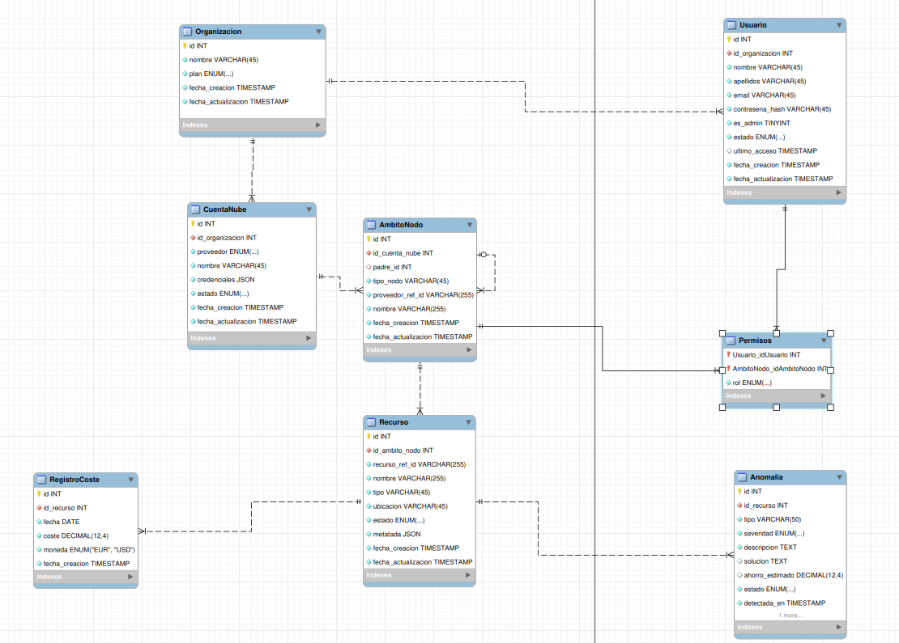

# Arquitectura — nube-eficiente

> Documento de referencia de la arquitectura del proyecto. Es la **fuente única de verdad**
> para la estructura, el modelo de datos y las decisiones de diseño. El
> [README](../README.md) y el [CLAUDE.md](../CLAUDE.md) enlazan aquí en lugar de duplicar
> esta información.

## Índice

- [Visión general](#visión-general)
- [Estructura del monorepo](#estructura-del-monorepo)
- [Modelo de datos](#modelo-de-datos)
- [Estrategia de IDs](#estrategia-de-ids)
- [Abstracción de proveedores cloud](#abstracción-de-proveedores-cloud)
- [Decisiones de diseño](#decisiones-de-diseño)
- [Estado de implementación](#estado-de-implementación)

---

## Visión general

`nube-eficiente` es una plataforma SaaS de **FinOps**: permite a una organización conectar
sus cuentas en proveedores cloud (Azure, AWS, GCP), ingerir sus recursos, rastrear los
costes diarios y detectar anomalías de gasto mediante IA.

El backend está organizado en capas con responsabilidades bien separadas:

```
                ┌──────────────────────────────────────────────┐
                │                  frontend/                    │  React/Astro (pendiente)
                └───────────────────────┬──────────────────────┘
                                        │ HTTP/REST
                ┌───────────────────────▼──────────────────────┐
                │                   app/api/                    │  Endpoints REST (pendiente)
                └───────────────────────┬──────────────────────┘
                                        │
        ┌───────────────────────────────┼───────────────────────────────┐
        │                               │                               │
┌───────▼────────┐            ┌─────────▼─────────┐            ┌────────▼────────┐
│ app/ingestion/ │            │     app/ai/       │            │  app/api lógica │
│ ingesta cloud  │            │ detección anomalías│           │   de negocio    │
│  (pendiente)   │            │   (pendiente)     │            │                 │
└───────┬────────┘            └─────────┬─────────┘            └────────┬────────┘
        │                               │                               │
        └───────────────────────────────┼───────────────────────────────┘
                                        │
        ┌───────────────────────────────┼───────────────────────────────┐
        │ app/shared/providers/         │      app/shared/database/      │
        │ abstracción multinube         │      modelos ORM + sesión      │
        └───────────────────────────────┴───────────────────────────────┘
                                        │
                                ┌───────▼────────┐
                                │  PostgreSQL 16 │
                                └────────────────┘
```

---

## Estructura del monorepo

El repositorio es un **monorepo políglota**: convive código Python (backend) con código no
Python (frontend, IaC). `app/` es la **única capa Python** del proyecto.

```
nube-eficiente/
├── app/                    # Backend Python (único paquete Python)
│   ├── shared/
│   │   ├── database/
│   │   │   ├── models/     # Modelos ORM SQLAlchemy (8 entidades)
│   │   │   ├── migrations/ # Migraciones Alembic
│   │   │   ├── base.py     # DeclarativeBase
│   │   │   └── session.py  # engine + SessionLocal + get_db()
│   │   ├── providers/      # Abstracción de proveedores cloud
│   │   │   ├── cloud_provider.py   # ABC (verify_credentials/list_resources/get_costs)
│   │   │   ├── schemas.py          # DTOs: ScopeDTO, ResourceDTO
│   │   │   └── azure/              # Implementación Azure
│   │   └── core/           # Utilidades transversales (vacío aún)
│   ├── ingestion/          # Ingesta de recursos cloud (vacío aún)
│   ├── api/                # API REST backend↔frontend (vacío aún)
│   ├── ai/                 # Detección de anomalías (vacío aún)
│   ├── scripts/            # Scripts de desarrollo y pruebas manuales
│   ├── alembic.ini         # Configuración de Alembic
│   ├── pyproject.toml      # Empaquetado Python (where = [".."])
│   └── requirements.txt    # Dependencias Python
├── frontend/               # React/Astro — no Python, aún vacío
├── infra/                  # IaC — Terraform (aún vacío)
├── docs/                   # Documentación (este directorio)
│   ├── ARCHITECTURE.md
│   ├── CONTRIBUTING.md
│   └── database/           # Diagrama ER del esquema
├── docker-compose.yml      # PostgreSQL 16 + pgAdmin 4
├── .env / .env.example     # Variables de entorno
├── CLAUDE.md               # Contexto para asistentes IA
└── README.md
```

---

## Modelo de datos

PostgreSQL 16 con SQLAlchemy 2.0. Los modelos viven en
[app/shared/database/models/](../app/shared/database/models/) — **revisa siempre ese
directorio para conocer columnas y relaciones exactas**.

### Entidades

| Modelo | Tabla | PK | Descripción |
|---|---|---|---|
| `Organizacion` | `organizacion` | UUID | Tenant raíz; plan: free/pro/enterprise |
| `Usuario` | `usuario` | UUID | Pertenece a una organización; flag `es_admin` |
| `CuentaNube` | `cuenta_nube` | UUID | Credenciales JSONB de proveedor cloud |
| `AmbitoNodo` | `ambito_nodo` | UUID | Árbol jerárquico de scopes (autorreferencial) |
| `Recurso` | `recurso` | Integer | Recurso cloud concreto con propiedades JSONB |
| `RegistroCoste` | `registro_coste` | Integer | Coste diario por recurso (Numeric 16,6) |
| `Anomalia` | `anomalia` | Integer | Anomalía detectada: info/warning/high/critical |
| `Permiso` | `permisos` | (usuario_id, ambito_id) | RBAC: propietario/lector/facturacion |

### Jerarquía

```
Organizacion
└── CuentaNube (azure/aws/gcp)
    └── AmbitoNodo (árbol: subscription → resource_group → ...)
        ├── Recurso
        │   ├── RegistroCoste (serie temporal de costes)
        │   └── Anomalia
        └── Permiso (usuario ↔ ambito)
```

### Diagrama ER



> El diagrama editable está en `docs/database/diagrama-base-datos.mwb` (MySQL Workbench).

---

## Estrategia de IDs

Se usan IDs **mixtos** de forma deliberada:

- **UUID** para entidades de negocio principales (`organizacion`, `usuario`, `cuenta_nube`,
  `ambito_nodo`): identificadores no adivinables, seguros de exponer y de generar en
  cliente/distribuido.
- **Integer autoincremental** para series temporales de alto volumen (`recurso`,
  `registro_coste`, `anomalia`): más eficiente en inserciones masivas e índices.

---

## Abstracción de proveedores cloud

Sigue el patrón **Ports & Adapters (hexagonal)**: la lógica de negocio depende de una
interfaz abstracta, no de SDKs concretos.

- **Puerto** — [app/shared/providers/cloud_provider.py](../app/shared/providers/cloud_provider.py):
  la ABC `CloudProvider` con tres métodos: `verify_credentials()`, `list_resources()`,
  `get_costs()`.
- **DTOs** — [app/shared/providers/schemas.py](../app/shared/providers/schemas.py):
  `ScopeDTO` y `ResourceDTO`. Los proveedores devuelven DTOs **independientes del
  proveedor**, nunca modelos ORM. La capa de ingesta es la única que traduce DTO → ORM.
- **Adaptador Azure** — [app/shared/providers/azure/azure_provider.py](../app/shared/providers/azure/azure_provider.py):
  `AzureProvider`. Hoy implementa solo `verify_credentials()` (autenticación vía
  `ClientSecretCredential`); `list_resources()` y `get_costs()` lanzan `NotImplementedError`.

La lógica de ingesta (capa `app/ingestion/`) que consumirá estos DTOs y los persistirá de
forma idempotente está especificada en [plan-ingesta.md](../plan-ingesta.md) y aún no está
implementada.

---

## Decisiones de diseño

- **Alembic en `app/shared/database/migrations/`**, no en la raíz: es una herramienta del
  backend Python, no del monorepo completo. Las migraciones **siempre** se ejecutan desde
  `app/` (ver [CONTRIBUTING.md](CONTRIBUTING.md)).
- **`pyproject.toml` en `app/` con `where = [".."]`**: setuptools busca el paquete `app` un
  nivel arriba (la raíz del repo). De ahí que se instale con `cd app && pip install -e .`.
- **`frontend/` en la raíz**, fuera del paquete Python: React/Astro no es Python.
- **`docker-compose.yml` en la raíz**: orquesta todos los servicios (db, pgAdmin, y en el
  futuro backend/frontend).
- **Credenciales en JSONB**: el campo `credenciales` de `CuentaNube` almacena las
  credenciales del proveedor como JSON flexible. **Pendiente: cifrado en reposo.**
- **Enums en SQLAlchemy con `name=`**: para que Alembic los gestione como tipos nativos de
  PostgreSQL.
- **`func.now()` como `server_default`** en timestamps; `onupdate=func.now()` en
  `fecha_actualizacion`.
- **`get_db()` es un generador** ([app/shared/database/session.py](../app/shared/database/session.py)),
  compatible con la inyección de dependencias de FastAPI.

---

## Estado de implementación

| Capa | Estado | Notas |
|---|---|---|
| Esquema de BD + migración inicial | ✅ Completo | 8 modelos, migración aplicada |
| Sesión / `get_db()` | ✅ Completo | engine + SessionLocal |
| `CloudProvider` (ABC) | ✅ Completo | Interfaz definida |
| DTOs (`ScopeDTO`, `ResourceDTO`) | ✅ Completo | En `schemas.py` |
| `AzureProvider` | ⚠️ Parcial | Solo `verify_credentials()` |
| `ingestion/` | ❌ Pendiente | Especificado en `plan-ingesta.md` |
| `api/` (REST) | ❌ Pendiente | Requiere añadir FastAPI |
| `ai/` (anomalías) | ❌ Pendiente | — |
| `frontend/` | ❌ Pendiente | React/Astro |
| `infra/` (Terraform) | ❌ Pendiente | — |
| Suite de tests | ❌ Pendiente | Solo script manual de Azure |
